  

  

  

## About me

Hey, I'm **M19**. I make Minecraft server plugins — shops, menus and economy systems — and I'm learning software development one project at a time.

- **Now:** Minecraft plugins in Java
- **Learning:** JavaScript, Python and web development
- **Next:** bigger projects outside Minecraft

## Tech stack

  
  
  
  
  
  
   
  
  
  
  

## Projects

Minecraft plugins I've built under **AlphaStudio**, mostly in `Java 21` on `Paper` with `Gradle`. Source is private.

#### Server cores

| Plugin | What it does |
|---|---|
| **Alpha System** | All-in-one server core: homes, teleports, economy, chat, moderation and Discord link |
| **AlphaWildSystem** | Core for Wild PvP servers: arenas, kits, crates, combat and kill rewards |
| **AlphaPractice** | PvP practice plugin with its own menus |

#### Gameplay

| Plugin | What it does |
|---|---|
| **AlphaLevels** | Earn XP from playtime and kills, level up for rewards |
| **AlphaQuests** | Quests, quest chains, streaks and timed races |
| **AlphaRewards** | Daily rewards and streak rewards |
| **AlphaEvent** | Spleef event minigame |
| **StealABlock** | Block-stealing minigame |
| **AlphaTools** | Special tools: drill, tree chopper, infinite buckets and more |

#### Economy

| Plugin | What it does |
|---|---|
| **AlphaSell** | Sell items for money through a clean menu |
| **AlphaOrder** | Buy-order marketplace between players |
| **Claim-block shop** | In-game shop for buying land-claim blocks |

#### Utility

| Plugin | What it does |
|---|---|
| **AlphaTPA** | Teleport requests with confirm menus, countdown and safe teleport |
| **AlphaGraves** | Saves your items in a grave when you die |
| **AlphaFirstSpawn** | Sends new players to a set spawn on first join |
| **AlphaAlytraBoost** | Infinite elytra boost with cooldown for lobbies |

## Activity

  

