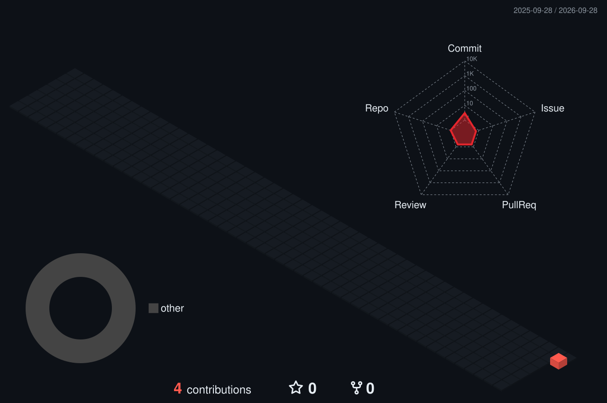

<p align="center">
  
</p>

<p align="center">
  
</p>

<p align="center">
  
</p>


## About me

I'm M19, a developer in the making. I got into programming by building systems for Minecraft servers — in-game shops, custom menus and economy features — and I'm now learning IT and software development properly, one real project at a time.

```yaml
learning:  [Java, JavaScript, Python]
building:  Minecraft server systems (menus, shops, economy)
next:      web development and bigger standalone projects
```

## Tech stack

<p>
  
  
  
  
  
  
  <br />
  
  
  
  
</p>

## Projects

| Project | What it does | Built with |
|---|---|---|
| **Claim-block shop** | In-game GUI shop for buying GriefPrevention claim blocks, with a live balance check before each purchase | `DeluxeMenus` `Vault` `JavaScript` |
| *Next project* | *In progress* | — |


## Activity

<p align="center">
  
</p>

<p align="center">
  
</p>

<p align="center">
  <sub>Both graphics regenerate automatically every day from my GitHub activity.</sub>
</p>
